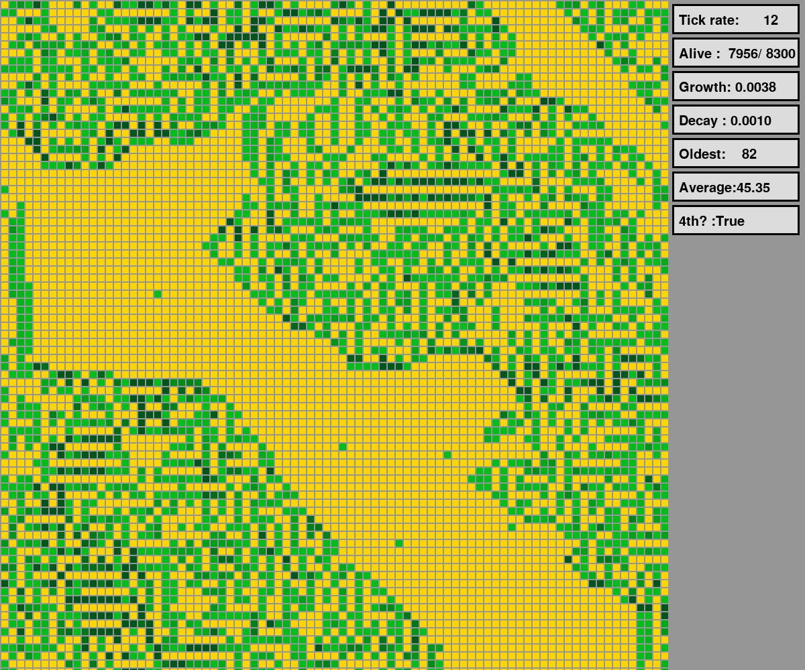

# DataDesert
A cellular automaton-based virtual garden

## Setup
- pip install -r requirements.txt

## Usage
- Change app/game parameters in main.py
- Run `./main.py`

## Controls
- `[Escape]` exits the garden
- `[p]` pauses the garden's evolution
- `[r]` resets the garden with a new seed
- `[q]` increases the growth rate
- `[w]` decreases the growth rate
- `[a]` increases the decay rate
- `[s]` decreases the decay rate

## Screenshot

